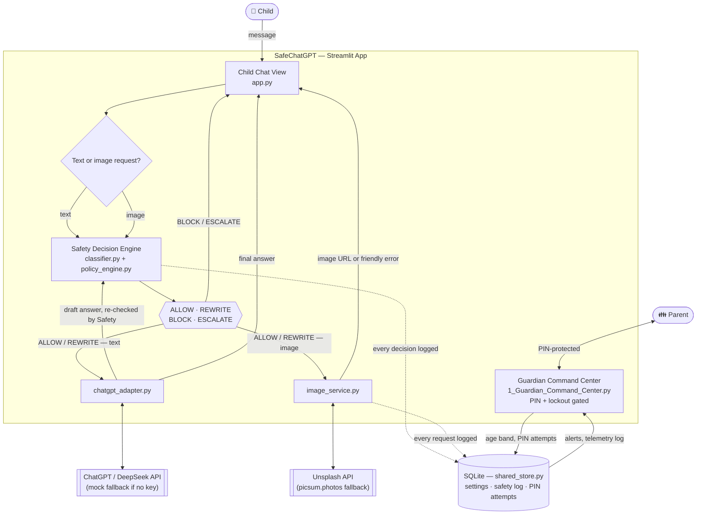

# Architecture

## Updated design

SafeChatGPT is not a generic AI gateway. It is a controlled web client for ChatGPT.

The parent blocks the official ChatGPT webpage for the child's account. The child uses SafeChatGPT instead — for both text questions and "show me a picture of..." image requests, checked the same way.

## Components

### 1. SafeChatGPT Web App

A Streamlit web app that gives the child a simple chat interface. The child does not see the API key, system prompt, or parental policy — for either a text answer or an image result.

### 2. Guardian Command Center (Parent Dashboard)

A separate, PIN-protected page (not linked from the child's page) lets the parent select the child's age band and view automated alerts whenever the child's input was blocked or escalated, including image requests (shown with a 📸 icon and a thumbnail). After 5 wrong PINs, entry locks for 5 minutes — tracked in the database, so it survives a page reload. The PIN is a lightweight PoC stand-in for real parent authentication.

### 3. Safety Decision Engine (Input & Output Checks)

`classifier.py` does rule-based detection of harmful categories and bypass attempts; `policy_engine.py` turns that into one of four decisions — `ALLOW`, `REWRITE`, `BLOCK`, `ESCALATE`. Every message runs through this before it reaches ChatGPT, and every draft answer runs through it again before the child sees it. Image requests use the exact same engine.

### 4. ChatGPT Adapter

Sends approved messages to the ChatGPT API (or DeepSeek, or any OpenAI-compatible endpoint) with a safety system prompt, a request timeout, and a capped retry count. If no API key exists, it uses mock mode for classroom demos.

### 5. Image Service

Detects "show me a picture of..." phrasing, runs the query through the same Safety Decision Engine, then searches Unsplash (age-band styled) or falls back to picsum.photos if no key is configured. A `REWRITE` decision swaps the query for a fixed safe topic before searching — the original wording never reaches Unsplash, even modified.

### 6. Shared Storage

`shared_store.py` persists settings, the safety log, and PIN-lockout state in SQLite — safe under concurrent writes, and durable when placed on a mounted volume in production (see [Production Deployment](production_deployment.md)).

## Key design decision

The child is not allowed to use the official ChatGPT webpage directly. The system relies on parental website blocking plus a protected replacement interface — one that answers both questions and image requests, checked the same way, before and after every model interaction.
